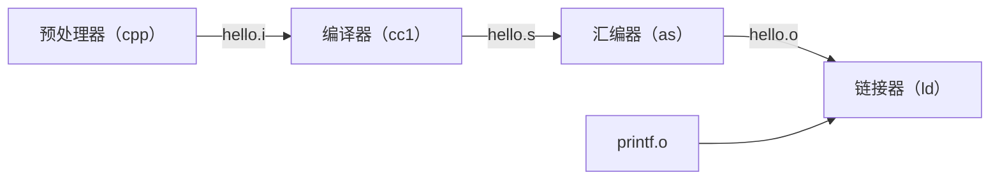

## 1. 信息就是位 + 上下文

源程序是以比特序列的形式存储的，8 位一字节，1 个字节表示 1 个文本字符。现代计算机系统大部分都是使用 ASCII 标准来表示字符。只由 ASCII 字符构成的文件成为文本文件，所有其他文件都称为二进制文件。

基本思想：

> 系统中所有的信息，包括磁盘文件、内存中的程序、内存中存放的用户数据以及网络上传送的数据，都是由一串比特表示的。区分不同数据对象的唯一方法就是我们读到这些数据对象时的上下文（整数、浮点数、字符串、机器指令）。

## 2. hello 程序的生命周期

```c
#include <stdio.h>

int main()
{
    printf("hello, world\n");
    return 0;
}
```



- 预处理：将头文件内容插入到源文件中
- 编译：将 hello.i 翻译成汇编程序的文本文件
- 汇编：将汇编程序翻译成机器语言的二进制文件
- 链接：将预编译的函数合并到二进制文件中

## 3. 执行程序

目标文件 hello 中的代码和数据通过 I/O 总线、I/O 桥、内存总线从磁盘加载到主存中。处理器开始执行 hello 程序的 main 程序中的机器语言指令，这些指令将字符串中的字节从主存复制到寄存器文件，再从寄存器文件复制到显示设备。

复制就是开销，因此出现了高速缓存，作为暂时的集结区域，存放处理器近期可能需要的信息，其访问速度几乎和寄存器一样。常说的三级缓存就是指 L1、L2、L3 高速缓存。数字越小，越靠近处理器，访问速度越快。

## 4. 操作系统管理硬件

操作系统两个基本功能：

- 防止硬件被失控的应用程序滥用
- 向应用程序提供简单一致的机制来控制复杂而又通常大不相同的低级硬件设备

如何实现？

- 进程（处理器、主存和 I/O 设备）
- 虚拟内存（主存、磁盘 I/O 设备）
- 文件（I/O 设备）

此外，虚拟机提供对整个计算机的抽象。

#### 进程

进程是操作系统对一个正在运行的程序的一种抽象。在一个系统上可以同时运行多个进程。并发运行是指一个进程的指令和另一个进程的指令是交错执行的。操作系统实现这种交错执行的机制称为上下文（状态信息）切换（操作系统内核执行）。

操作系统内核：操作系统代码常驻主存的部分。当应用程序需要调用操作系统的某些操作时，就会执行系统调用指令，将控制权传给内核。

#### 线程

一个进程可以有多个线程组成。往往线程间的切换比进程切换更容易共享数据，并且线程一般比进程更高效。

#### 虚拟内存

为每个进程提供一种假象，即每个进程都好像在独占使用主存。每个进程看到的内存都是一致的，称为虚拟地址空间。

虚拟地址空间划分为多个区，从最低地址向上分别为：

- 程序代码和数据
- 堆
- 共享库
- 栈
- 内核虚拟内存

#### 文件

字节序列。

## 5. 重要概念

#### Amdahl 定律

当我们对系统某个部分加速时，其对系统整体的影响取决于该部分的重要性和加速程度。若系统执行某应用程序需要时间为 $T_{old}$，假设系统某部分所需执行时间与该时间的比例为 $\alpha$，而该部分性能提升比例为 $k$。即该部分初始执行时间为 $\alpha T_{old}$，现在所需执行时间为 $(\alpha T_{old})/k$，因此总的执行时间为 

$T_{new} = (1-\alpha)T_{old} + (\alpha T_{old})/k = T_{old}[(1-\alpha)+\alpha / k]$

加速比为：$S=\frac{1}{(1-\alpha) + \alpha / k}$

> **要想显著加速整个系统，必须提升系统中相当大部分的速度。**

#### 并发和并行

并发：一个同时具有多个活动的系统

并行：用并发来使系统运行得更快
    
- 线程级并发（超线程：允许一个 CPU 同时执行多个控制流）
- 指令级并行（在较低的抽象层次上，现代处理器可以同时执行多条指令的属性）
- 单指令，多数据并行（允许一条指令产生多个可以并行执行的操作，即 SIMD 并行）

![[posts/images/cache.png]]
